# Full Stack Web Developer Nanodegree Program
## Item Catalog Project

A web application that provides a list of items within a variety of categories and integrate third party user registration and authentication using google-login. Authenticated users should have the ability to post, edit, and delete their own items and categories.

### Data
The database contains 3 tables as described below:
* `category` which contains info related to the categories in the application (id, name, and user_id).
* `item` table contains info of the items (id, title, description, user_id, category_id, date_created).
* `user` which records the info of the users which registered in the application (id, name, email, picture)

### Functionality
For a public user (i.e., not logged in), the homepage is displayed with a list of all existing categories and a list of the latest added items.
http://localhost:8000/catalog
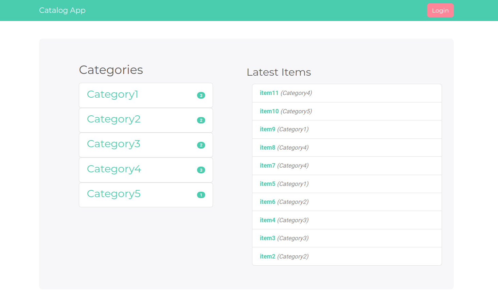
Once a category is clicked, the list of all its items is shown.
http://localhost:8000/catalog/Category1/items
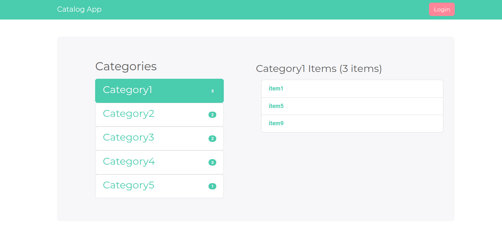
When an item is clicked, a page is displayed with the items details.
http://localhost:8000/catalog/Category4/item11/
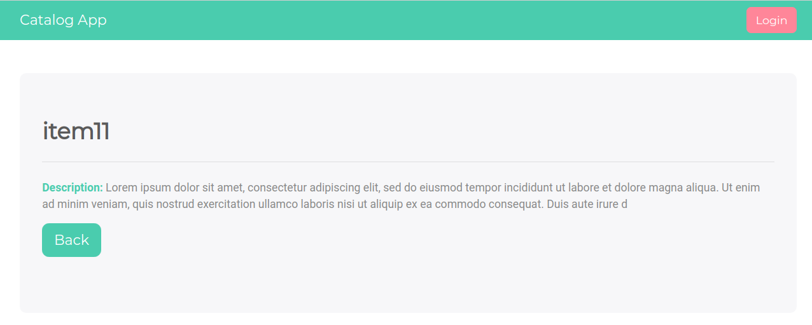
When the user presses 'login' button, they are redirected to the login page.
http://localhost:8000/login
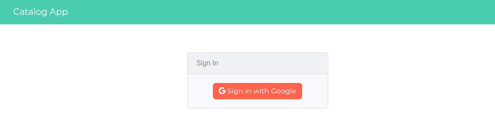
After the uuser logs in, they can start adding new categories and items, as well as editing and/or deleting their categories and items.
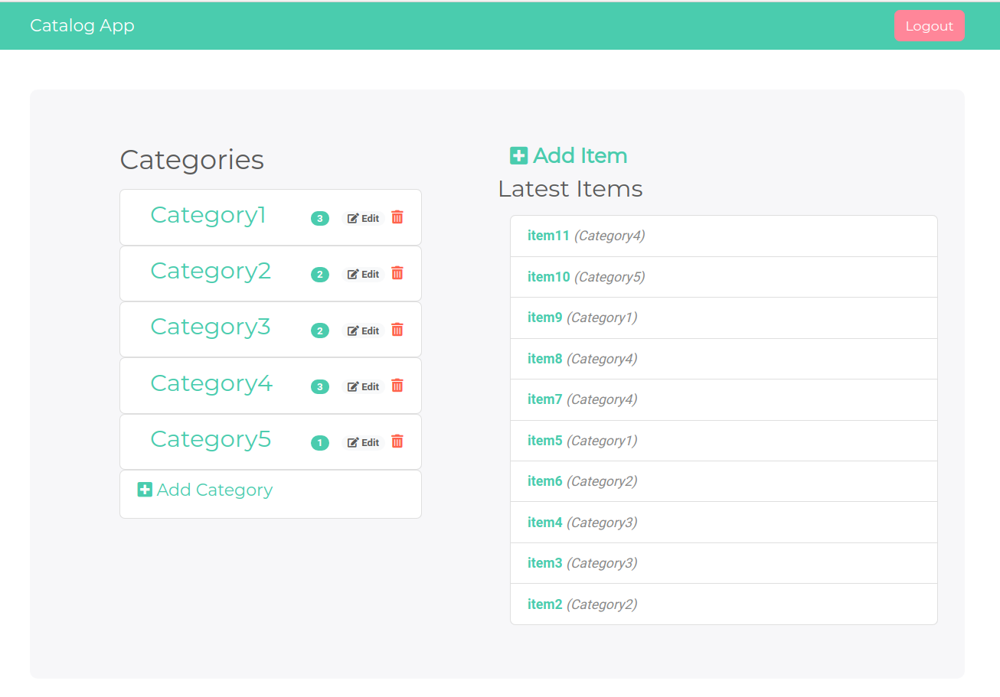
http://localhost:8000/catalog/Category1/editcategoory
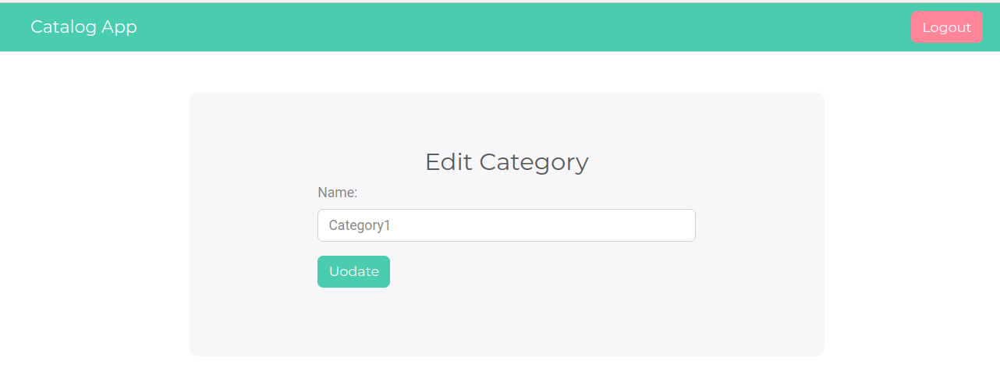
http://localhost:8000/catalog/Category1/deletecategory
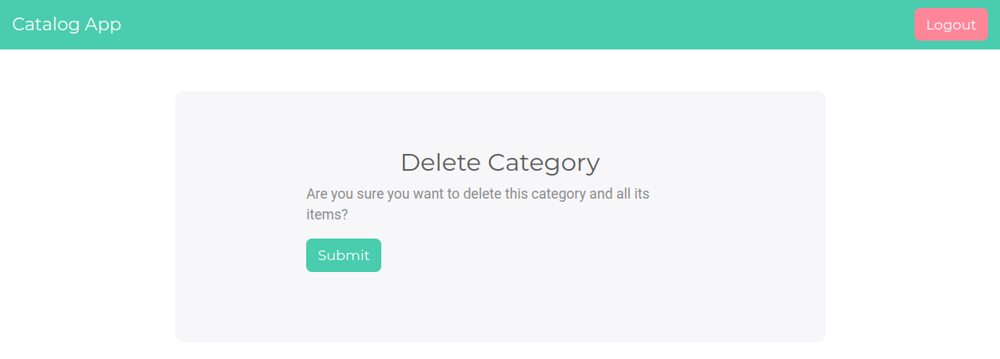
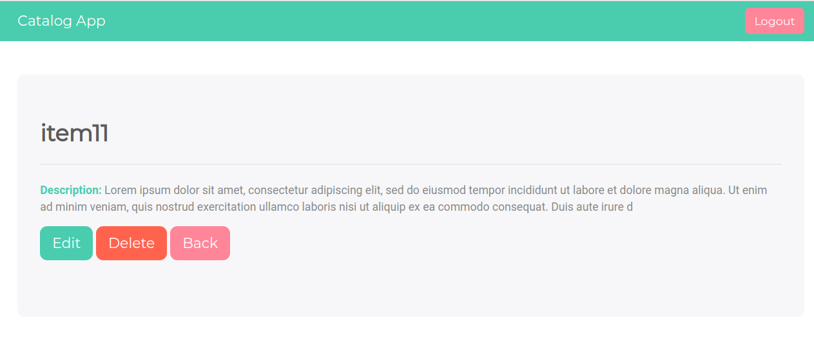
http://localhost:8000/catalog/Category4/item11/edit
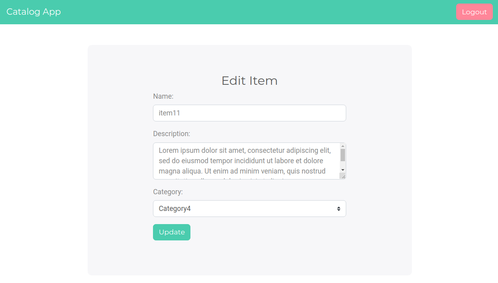
http://localhost:8000/catalog/Category4/item11/delete
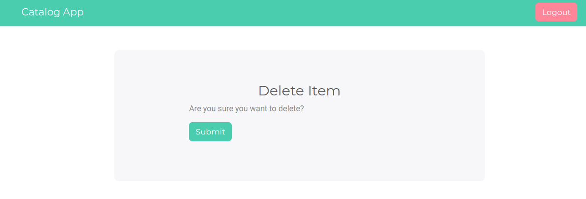

### JSON endpoint
* http://localhost:8000/catalog.json
  
* http://localhost:8000/catalog/Category5/item11.json
  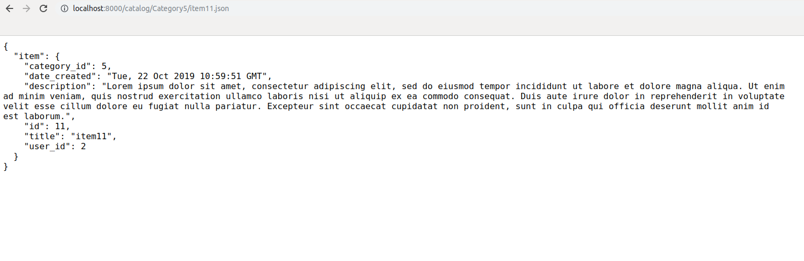

### Requirements
To run the application, you can use a Linux-based virtual machine (VM) which had all the above requirements installed and configured. To run the machine, you need to follow the steps below:
* Install [Vagrant](https://www.vagrantup.com/) and [VirtualBox](https://www.virtualbox.org/wiki/Downloads). 
* Use Github to fork and clone this [repository](https://github.com/udacity/fullstack-nanodegree-vm).
* Go to the sub-directory **vagrant** and execute the command `vagrant up'.
* Once the machine is up, execute `vagrant ssh` to login to it.
* make sure that the latest version of `Flask` and `sqlalchemy` is installed.
### Running the Tool
To run the reporting tool:
1. `cd` to the `/vagrant/catalog` folder.
2. Copy the files in the assignment folder to the current folder. 
3. Load and populate the database by running 
   ```
   python database_setup.py
   python lotsofitems.py
   ```
4. Create a new project and oauth credintials from google developers page (https://console.developers.google.com/). 
   1. Download your client_secrets JSON file and copy it to your current folder.
   2. Rename the json file to client_secrets.json
   3. enter your client id in (login.js:line 4) instead of `<ENTER_YOUR_CLIENT_ID>`  
5. Run the server. 
    ```
    python application.py
    ```
6. Open your browser and type http://localhost:8000 to start using the application

## Author

**Asma Hakouz**

## LICENSE 
Released under the [MIT license](LICENSE)